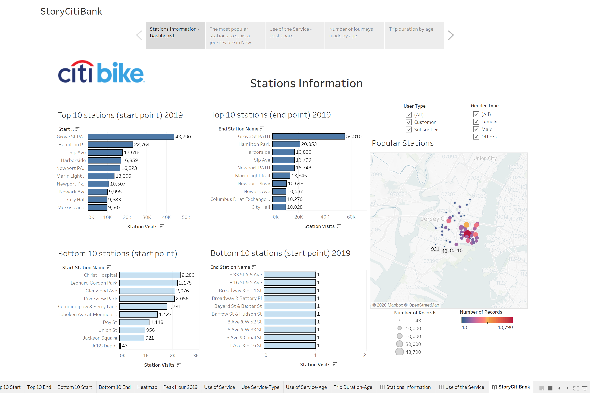
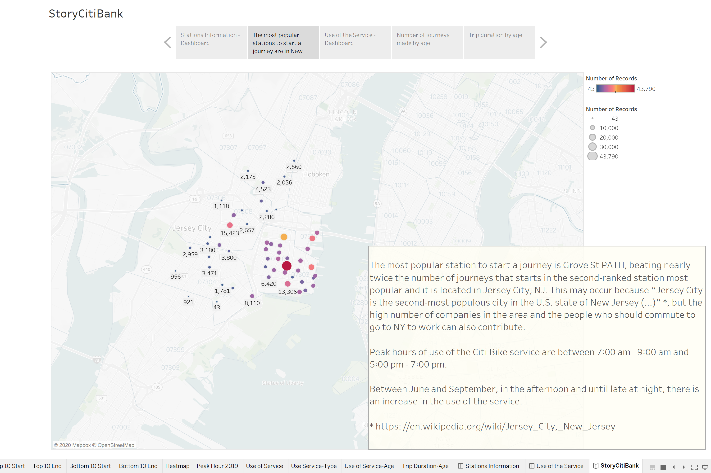
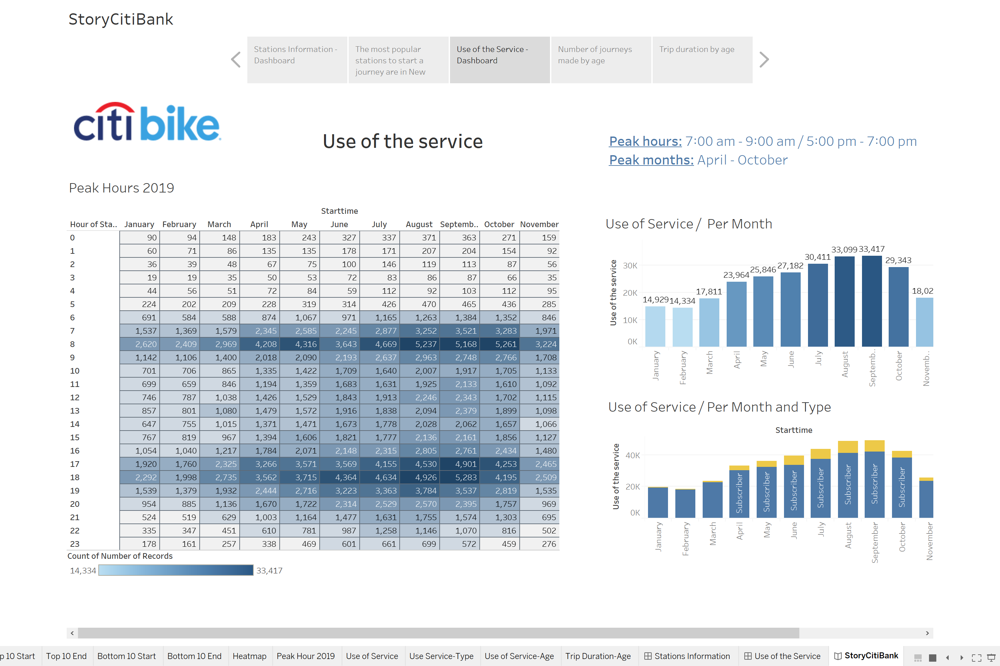
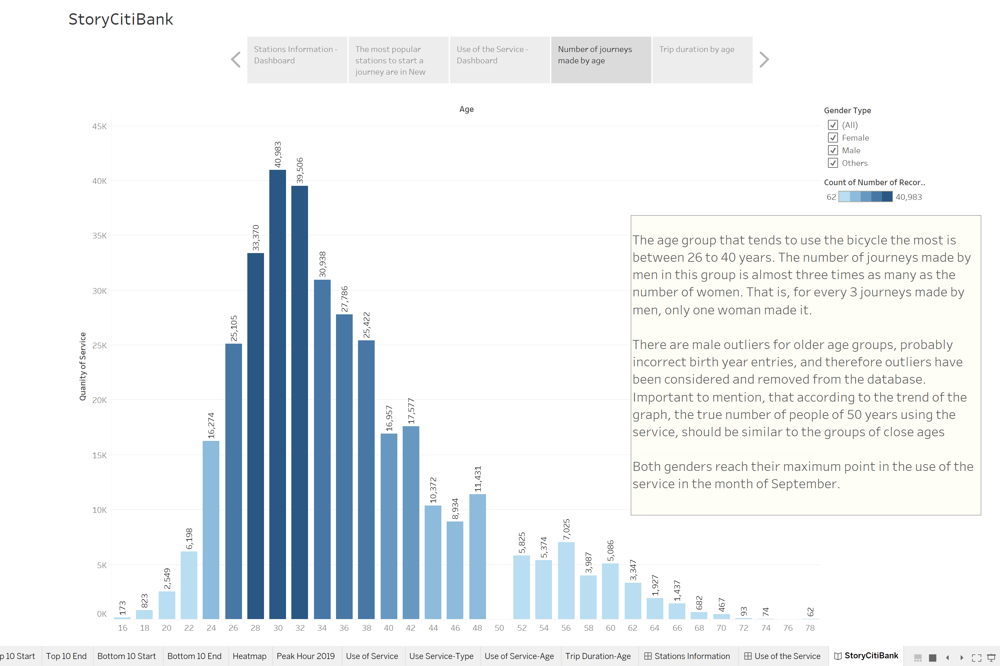
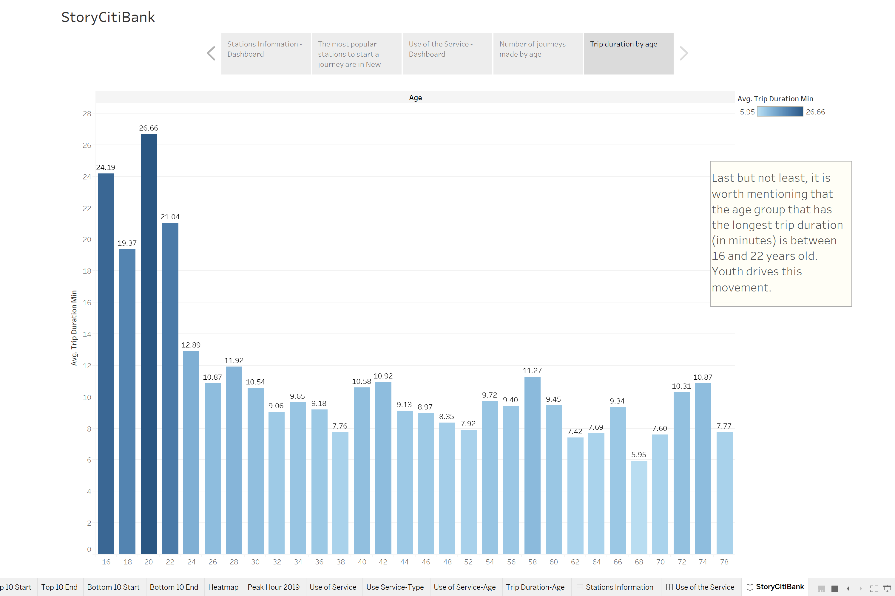

# Citi Bike NYC: Data Analysis 2019

 

## ABOUT

In this repository, you will find a Story and two Dashboards made in Tableau to analyze the information reported by [Citi Bike](https://www.citibikenyc.com/system-data) in 2019.

The idea of the exercise is to create a set of data reports to provide the answers about the bike service.

Technology Used:
- Python: Pandas
- Tableau

 

## TO OPEN IT 

* Clone from Github page.
* In terminal or gitBash, run a git clone in desired location to save app.
* Open Tableau in the desktop.
* Click "File" (Upper left side), click "Open", find the file and then click "Open" again.
* Be surprised!

 

## VISUALIZATIONS

 

* Dashboard: Stations Information

 

  

* Map: Popular Stations

 

  

* Dashboard: Use of the Service

 

  

* Number of journeys made by age

 

  

* Trip duration by age

 

  
